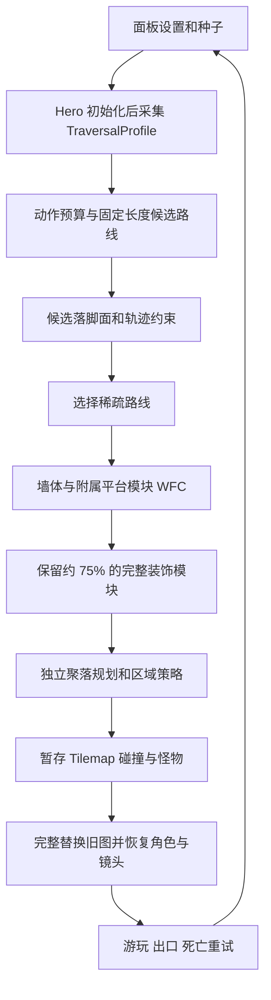

# A Thousand Battles Later：项目交接

更新日期：2026-10-03。代码基线：`1c96487`。本文用于接手开发；具体审计证据见 [COMMIT_AUDIT.md](COMMIT_AUDIT.md)，长期问题见 [TODO.md](TODO.md)。

## 1. 先看这几件事

- 项目是 Unity 2D 横板动作平台游戏，包含两关正式地图、独立随机地图测试场景。
- 最近开发重点是 **WFC 单房间地图**，当前实现已经提交到本地 Git 历史；之前“单房间修改尚未提交”的状态已过期。
- 当前默认随机房间宽 **100–150**、高 **50–100**。宽度下限由后续提交从 50 改成了 100，低于 100 的输入会提升为 100。
- 当前新地图默认使用 UTC 时间种子。复现问题时必须保存实际种子，并关闭时间种子选项；旧的固定默认种子示例只适用于历史版本。
- WFC 采用动作约束直接生成。**不要加入运行时生成后的可达性搜索、修补或筛选。** 开发阶段的真实角色测试可以、也应该独立运行。
- README 中的 **32/32 Play Mode、212 个布局检查通过**属于 2026-09-29 的实现。后来改动了路线、刷怪和攻击边界，不能把旧结果视为当前版本已验收。
- 2026-10-03 后续已修复生成眼球怪的侦测距离回归：自身距离和聚落区域必须同时满足；本机原工程 Unity 回归 11/11 通过，见 `Logs/review-eye-tests.xml`。
- 用户已确定保留最新稀疏路线效果，紧凑候选允许近平台，不恢复所有水平动作 75% 的下限；构建校验及实际间距诊断待本轮后续完成。
- 隔离副本之前的依赖/IL Post Processor 失败属于历史环境记录；原工程本次可以编译并运行眼球测试，地图新验证尚待完成。

## 2. 环境、仓库和场景

| 项目 | 当前信息 |
|---|---|
| 本机工作目录 | `D:\github libraries\A Thousand Battles Later` |
| 仓库 | `https://github.com/wohooooo23/AThousandBattlesLater` |
| Unity | `6000.5.2f1 (eb73d3b415a1)`，以 `ProjectSettings/ProjectVersion.txt` 为准 |
| 本机编辑器 | `D:\Unity_editor\Editor\Unity.exe`；无需移动编辑器 |
| 最近代码提交 | `1c96487 Add sparse WFC routes and separated enemy settlements` |
| 审计时当前分支 | `wfc`；不要沿用上一轮仍在 `main` 的假设 |
| 审计开始时工作区 | 干净；本文及审计文档为随后新增的修改 |
| Git 管理范围 | Assets、Packages、ProjectSettings 和显式允许的根目录文档 |
| 本地生成物 | Library、Temp、Logs、构建输出等被忽略；`.meta` 必须保留 |

场景：

| 场景 | 用途 |
|---|---|
| `Assets/Scenes/StartMenu.unity` | 开始菜单 |
| `Assets/Scenes/stage1_full.unity` | 第一关、邪恶巫师 Boss |
| `Assets/Scenes/stage2_full.unity` | 第二关、国王 Boss |
| `Assets/Scenes/Help.unity` | 帮助 |
| `Assets/Scenes/WfcRoom20x20.unity` | 保留的初版 20×20 回归样例 |
| `Assets/Scenes/WfcDungeon.unity` | 当前单房间随机地图测试入口 |

以上六个场景在 Build Settings 中启用，正式场景顺序保持在前。`WfcDungeon` 名称沿用早期多房间阶段；当前默认生成一个房间。

## 3. 已完成工作总览

### Hero 整理与伤害公式

- Hero 根节点的玩家功能整合到 `Assets/Scripts/Role_Hero_State/Role.cs`：移动、近战、投掷、血量、受击、回复、死亡和主动下穿平台。
- Hero 不再挂敌人使用的 `Entity_Combat`；共享 `Entity_VFX` 和 Visual 的 Animator/事件转发组件保留。
- 基础攻击公式为：**角色基础攻击 + 武器基础攻击 + 武器锻造等级 × 10**，再应用独立伤害倍率。装备刷新不再覆盖基础攻击，也不累加写回。
- `PlayerProgression` 继续连接装备、背包、锻造与 UI；防御公式仍是旧逻辑，见 TODO。
- 修过同帧状态覆盖：地面/空中子状态在基类已经切换状态后及时返回，避免移动逻辑覆盖跳跃。
- 随机地图有专用地面探针配置，避免上穿单向平台时误判落地、恢复跳数。正式关卡未配置时保持旧探针语义。

### 眼球怪状态机

- 两关共享 `Assets/Enemy/Mobs/FlyingEye/Mob_FlyingEye.prefab`。
- 根节点 `FlyingEyeController : Entity` 复用 `StateMachine / EntityState`，包含 Idle、Patrol、Chase、Attack、Hurt、Dead。
- Visual 使用 Animator、Controller 和 `Entity_AniamtionTriggers`，状态切换由参数和过渡完成。
- Attack1 第 7 帧释放；普通难度约 0.5 秒释放、0.667 秒结束，困难难度按风向前摇倍率加速。
- 非致命受击打断未释放攻击；已释放投射物继续独立飞行；死亡与奖励有去重保护。
- 最新聚落改动又增加了目标区域检查、失去合法目标后的限制和投射物活动区域，必须补做真实战斗回归。

### Boss 动画、寻路与物理

- 巫师来自 `Assets/Enemy/Bosses/EvilWizard/Boss_EvilWizard.prefab`；国王直接保存在 `stage2_full.unity`。
- 两者都有 Visual Animator 和 Idle/Run/Attack1–3/Hurt/Death 动画资源。
- Boss 动画迁移保留了 `OnCastBegin/Charge/Fire/End`、`NotifyHurt/Dead` 接口，技能控制器仍决定释放与伤害时刻。
- **Boss 尚未完全迁成眼球怪式纯参数/过渡架构**：施法阶段仍由代码选择、采样动画进度，后续统一改造在 TODO。
- 正式关卡 Boss 不再依赖固定 `EnemyNavigationNode`。`BossLandingGraph` 从碰撞体采样落脚点，`EnemyPlatformNavigator` 检查跳跃弧线并运行 A*。
- Boss 非跳跃时冻结横向物理，保留重力；跳跃结束等待真实落地，清除残余横向速度，减少被 Hero 挤走或卡墙的问题。
- Boss 的运行时导航搜索是独立战斗系统，与“随机地图禁止生成后可达性检查”不是同一个流程。

## 4. 当前随机地图的约束与参数

| 项目 | 当前行为 |
|---|---|
| 尺寸 | 内区域宽 100–150、高 50–100；外壳另加一格 |
| 格子尺寸 | 默认 4.5 世界单位；Hero 和怪物缩放沿用现有约定 |
| 入口/出口 | 左下出生、右上 Boss 门美术；出口仅完成测试，不触发 Boss 战 |
| 能力 | 单房间测试 Hero 解锁二段跳、冲刺；普通墙可蹬墙 |
| 光滑墙 | 当前单房间不使用；旧多房间参考模式仍保留相关代码 |
| 飞镖 | 暂不纳入移动能力预算；没有因此限制背包飞镖 |
| 路线长度 | `入口到出口欧氏距离 × routeMultiplier`；默认 2，允许请求 1–10，实际可行范围由约束决定 |
| 长度单位 | 格；入口、各动作落脚点、出口之间的折线段长度之和 |
| 长度误差 | 验证目标小于 0.1 格 |
| 复现 | 实际种子、尺寸、能力、密度、倍数、生成器版本、物理步长共同参与 |
| 失败 | 报告冲突，保留上一张完整地图；首次失败可通过 F5 再生成 |

长度是设计路线的长度，并不保证所有玩家的最短通关距离。普通墙允许蹬墙，熟练玩家可能抄近路。

当前路线有正负高度变化、不同宽度平台和多个折返点。宽松候选采用较大的向上步幅，并优先选择落脚点数量最少的有效候选；候选不足时可以使用紧凑布局并显示状态说明。平台加宽后的水平利用率存在审计问题，详见审计文档，不能简单宣称所有跳跃仍满足旧版 75%–90% 要求。

## 5. 随机地图完整 pipeline



1. **输入与快照。** `WfcDungeonGenerator.Start` 等待 Role/装备初始化后采集 `TraversalProfile`。时间种子只在 UI/新地图入口产生，确定性生成器内部不读取当前时间。禁用时间种子后可手输固定种子。
2. **动作预算。** `WindingTraversalBudget` 根据速度、重力、碰撞体、跳跃和冲刺参数估算能力；考虑固定物理步长、冲刺期间保留重力、完整冲刺结束与落地制动时间。
3. **路线候选。** `WfcWindingRoomLayout.MakeVerticalSteps/MakeRoutes` 构造上升、下降、水平跳跃和冲刺段，求解转折幅度以满足固定长度。`PrepareRoute/BlocksFlight` 在候选阶段检查落脚面和单向平台对下降轨迹的影响。
4. **稀疏选择。** 合并紧凑与宽松候选，先保留落脚点最少的一组，再以权重选择。这个优化针对候选路线，不是生成后运行寻路器筛掉地图。
5. **地形 WFC。** `FillTerrain` 将矩形墙、顶部盖板和侧翼平台作为同一选项求解，使用最低熵、传播和有限回溯。预算耗尽会抛出有上下文的错误；空选项与求解失败明确区分。最新提交在完整求解后按空间分散程度保留约 75% 的非空装饰模块。
6. **聚落。** `WfcEncounterPlanner` 在现有承载面或新增实体地基上选位置，默认按面积请求 3–7 处聚落，限制聚落距离、出生安全半径和预警半径。密度 1 时每处目标为 4 个 Orc、1 个眼球怪，承载空间不足时减量并警告。它是独立的几何约束规划步骤，不是新的可达性搜索。
7. **渲染和碰撞。** 九宫格墙面根据最终实体占用关系选择边角。分数格平台用 Tile transform matrix 渲染，同时用独立薄 BoxCollider2D 和单向 Effector 支撑，避免合并成实体台阶侧壁。实体地形与单向平台分别处理。
8. **怪物运行。** `WfcEnemyGeometry` 读取实际根碰撞体尺寸及偏移。`GeneratedEnemyBounds.Configure` 使用生成根节点局部坐标，避免暂存地图移回原点后范围失效；下一物理步预测限制越界。攻击获取目标、命中和眼球弹体都检查区域策略；已发射弹体持有复制的策略。
9. **切换与清理。** 构建时暂停 Hero 和旧地图，在远处暂存新内容；成功后替换，失败恢复旧图。`GeneratedMapContent` 统一管理地图、怪物、投射物和预警，重生成时整批销毁。
10. **镜头与重试。** 复用两关的 `MapCameraFollow2D`，视野 28、平滑 0.14、边界余量 1。F6 和死亡重试保留本次成功布局的种子、尺寸、密度、路线倍数和角色能力，不采用面板尚未应用的移动参数。

注意：物理步长记录在布局中，但生成入口仍读取当前 `Time.fixedDeltaTime`。不要在一次复现/重试期间变动物理项目设置并假定布局完全不变；更完整的生成快照封装属于后续工作。

## 6. 关键文件导航

| 文件/目录 | 接手时关注点 |
|---|---|
| `Assets/Scripts/Map/WfcDungeonSettings.cs` | 尺寸范围、固定/随机尺寸、倍率、素材和敌人 Prefab |
| `Assets/Development/WfcDungeon/Settings.asset` | 场景实际引用的配置资源 |
| `Assets/Scripts/Map/WfcDungeonSeed.cs` | UTC 秒种子，同秒调用递增 |
| `Assets/Scripts/Map/TraversalProfile.cs` | 初始化后的真实角色能力快照 |
| `Assets/Scripts/Map/WindingTraversalBudget.cs` | 动作时间、距离、高度估算 |
| `Assets/Scripts/Map/WfcWindingRoomLayout.cs` | 当前单房间生成核心，Revision 4 |
| `Assets/Scripts/Map/WfcConstraintSolver.cs` | 共享 WFC/CSP 求解器 |
| `Assets/Scripts/Map/WfcDungeonLayout.cs` | 布局记录、签名、分发；保留 GenerateMultiRoom |
| `Assets/Scripts/Map/WfcEncounterPlan.cs` | 聚落记录、策略、敌人碰撞体测量 |
| `Assets/Scripts/Map/WfcEncounterPlanner.cs` | 聚落承载面、地基、分布和刷怪 |
| `Assets/Scripts/Map/WfcDungeonGenerator.cs` | 面板、生成事务、铺图、碰撞、实例化、重试 |
| `Assets/Scripts/Map/GeneratedEnemyBounds.cs` | 怪物范围、边缘保护、攻击区域策略 |
| `Assets/Scripts/Map/GeneratedMapContent.cs` | 生成内容及攻击附属物归属 |
| `Assets/Scripts/Map/WfcDungeonExit.cs` | 出口触发 |
| `Assets/Editor/Tools/World/WfcDungeonBuilder.cs` | 场景构建、老离线校验、预览；校验需更新 |
| `Assets/Editor/WfcVarietyRegression.cs` | 多样性数据检查、地形预算检查 |
| `Assets/Editor/WfcEncounterRegression.cs` | 聚落数据与边界策略小型检查 |
| `Assets/Tests/WfcWindingRoomPlayModeTests.cs` | 真实 Hero 路线、失败保留、重试 |
| `Assets/Tests/WfcDungeonPlayModeTests.cs` | 保留的多房间能力与镜头回归 |

## 7. 操作与验证

### 本机快速接手

1. 查看 `git status --short` 和本文基线，先确认是否已有他人继续修改。
2. 用指定 Unity 版本打开项目，进入 `WfcDungeon`。
3. F1 显示配置；Tab 切换全图/跟随；F5 生成新的时间种子地图；F6 重试当前地图；Home 回到出生点。
4. 复现问题时关闭时间种子，输入报告里的 seed。若需要指定尺寸，同时关闭随机尺寸，然后“Apply and regenerate”。
5. 保存面板状态、实际宽高、倍率、能力快照和控制台 reproduction ID。宽度低于 100 会被归一化，不能把请求宽度当成实际宽度。

### 自动与手动验证的区别

- `WfcVarietyRegression` 和 `WfcEncounterRegression` 的菜单需要先进入 Play Mode 并生成成功布局；它们主要检查数据不变量。
- `Run Encounter Safety Regression` 只验证少量区域策略和单步越界限制，未模拟完整战斗或真实角色通关。
- 真正的动作验证在 Unity Test Runner 的 PlayMode 测试中；有新路线类型后，应同时更新动作输入驱动和断言。
- 旧测试里的 50×50、83×97 请求现在会分别得到 100×50、100×97，旧“尺寸覆盖”描述已经失效。
- 旧 Builder 的校验逻辑尚未兼容下降段和聚落规则，不能只以菜单出现了生成场景就判定整套构建/验收通过。

建议回归组：`WfcWindingRoomPlayModeTests`、`WfcDungeonPlayModeTests`、`WfcRoomPlayModeTests`、`HeroRolePlayModeTests`、`FlyingEyeAnimatorPlayModeTests`。涉及 Boss 再运行 `BossAnimatorPlayModeTests` 和 `BossRelocationPlayModeTests`。

本机曾使用隔离工程 `C:\Users\lenovo\AppData\Local\Temp\atbl-boss-physics-20260927`。它是临时测试副本，不是版本权威源；使用前核对代码、场景、Prefab、依赖和 `.meta`。不要同时让两个 Unity 实例打开同一项目。

批处理测试命令示例（`$project` 指已准备好的隔离工程）：

```powershell
$unity = 'D:\Unity_editor\Editor\Unity.exe'
$project = 'C:\Users\lenovo\AppData\Local\Temp\atbl-boss-physics-20260927'
& $unity -batchmode -projectPath $project -runTests -testPlatform PlayMode `
  -testFilter 'WfcWindingRoomPlayModeTests;WfcDungeonPlayModeTests;WfcRoomPlayModeTests;HeroRolePlayModeTests;FlyingEyeAnimatorPlayModeTests' `
  -testResults "$project\handoff-tests.xml" -logFile "$project\handoff-tests.log"
```

PlayMode 测试不要附加 `-quit`；让 Test Runner 正常结束。当前流程需要图形设备，不使用 `-nographics`。构建静态场景时才使用 `-batchmode -quit -executeMethod WfcDungeonBuilder.Build`。

## 8. 后续优先级与协作约定

1. 先处理审计中的平台间距约束和旧验证器冲突，再扩展随机地形；当前审计结论与最新执行结果以 [COMMIT_AUDIT.md](COMMIT_AUDIT.md) 为准。
2. 为下降路线、不同宽度平台和聚落增加固定种子真实角色/战斗测试，并更新 README 中已经过期的当前参数与验证统计。
3. 继续完善地形构图，接近 stage1/2 的实际关卡观感；未来再考虑随机地图接入正式流程。
4. Goblin、Mushroom、Skeleton 和 Boss 的统一状态机迁移仍待完成。不要把“已经使用 Animator”误当成“已经统一状态逻辑”。
5. 已知旧问题包括：任意符文可能触发 Crimson 移动增益判断、两关 Hero 血量/基础攻击覆盖值差异、旧 Builder 与测试对敌人数/奖励/出生点的断言不一致、废弃 Unity API。具体项目见 TODO。
6. 每次技术实现更新 README 的完整 pipeline；发现旧项目非最佳实践时追加 TODO。保留资源 GUID、用户场景改动和已存在的调参，不借重构擅自改战斗平衡。
7. 本轮文档并不授权下一位自动恢复旧版尺寸、种子或刷怪数量；最新提交体现的新设计应先按现状理解，再针对已证实的问题修正。
